# Schneider Odace SFSP (portage du plugin Jeedom 'beagle') — intégration Home Assistant

[![GitHub Release][releases-shield]][releases]
[](https://github.com/hacs/integration)
[](#)

Cette intégration concerne le portage du plugin Jeedom `beagle` vers Home Assistant.

> [!NOTE]
> Un grand merci à **@rommess** qui a passé beaucoup de temps pour faire évoluer l'intégration :
> - Ajout de la prise en compte du module generic
> - Ajout de la gestion de l'association des modules
> - Ajout de la gestion du contrôleur Bluetooth branché sur PROXMOX avec une VM Home Assistant
> - Ajout de la gestion du contrôleur Bluetooth branché sur ESPHome

## Modules supportés

| Type | Statut | Notice(s) |
|------|--------|-----------|
| `switch` | ✅ | [Notice DCL](hardware/notice_DCL.pdf) |
| `dcl` | ✅ | [Notice DCL](hardware/notice_DCL.pdf) |
| `generic` | ✅ | [Actionneur générique 10A NLR InOut](hardware/manuel%20SCHS520192.pdf) |
| `shutter` | — | [Notice volet roulant](hardware/notice_VR.pdf) · [Moteurs compatibles](hardware/liste%20moteurs%20VR%20compatibles-Actionneur%20SE%20ma_j%209juillet2019.pdf) |
| `plug` | — | [Actionneur faux-plafond](hardware/MFR82543-00%203mai19.pdf) |
| `scene` | — | [Commandes groupées sans fil](hardware/GDE33208-0026Sept19.pdf) |

> ✅ = Testé et validé · — = Non testé (contributions bienvenues)

### Ressources Jeedom

Ces articles expliquent l'installation et la configuration des modules sous Jeedom, dont les principes sont transposables à cette intégration :

- [Recherche SFSP sur Jeedomiser](https://jeedomiser.fr/?s=sfsp)
- [Interrupteur Odace SFSP avec Jeedom](https://jeedomiser.fr/article/votre-interrupteur-odace-sfsp-avec-jeedom/)
- [Éclairage avec la gamme Odace SFSP et Jeedom](https://jeedomiser.fr/article/votre-eclairage-avec-la-gamme-odace-sfsp-et-jeedom/)
- [Actionneur minuteur générique Odace SFSP avec Jeedom](https://jeedomiser.fr/article/actionneur-minuteur-generique-odace-sfsp-avec-jeedom/)
- [Actionneur pour volet roulant Odace SFSP et Jeedom](https://jeedomiser.fr/article/votre-actionneur-pour-volet-roulant-odace-sfsp-et-jeedom/)
- [Interrupteur de scène Odace SFSP avec Jeedom](https://jeedomiser.fr/article/votre-interrupteur-de-scene-odace-sfsp-avec-jeedom/)

## Installation

## HACS

[](https://my.home-assistant.io/redirect/hacs_repository/?owner=slemeur91&repository=odace_sfsp&category=integration)

### Manuellement

1. Copier le dossier `custom_components/odace_sfsp/` dans `<config_home_assistant>/custom_components/`.
2. Redémarrer Home Assistant.
3. **Paramètres → Appareils et services → Ajouter une intégration → Schneider Odace SFSP**.
4. Choisir le contrôleur Bluetooth et suivre les étapes de configuration décrites ci-dessous.

## Configuration

### Choix du contrôleur Bluetooth

Lors de la première configuration, l'intégration propose de choisir le protocole de communication avec le contrôleur Bluetooth :

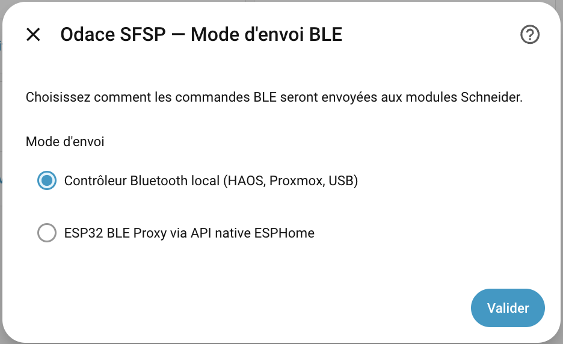

- **HCI** : contrôleur Bluetooth branché directement sur la machine qui héberge Home Assistant (Raspberry Pi, NUC, etc.) ou passé en USB à une VM (PROXMOX par exemple). Home Assistant détecte automatiquement les adaptateurs disponibles (typiquement `hci0`). C'est le mode le plus simple et le plus fiable.

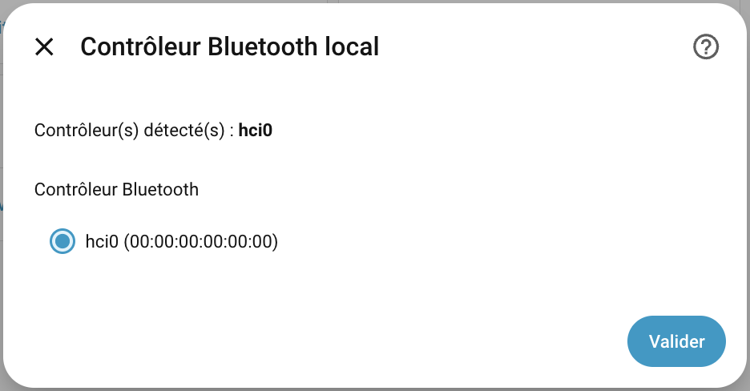

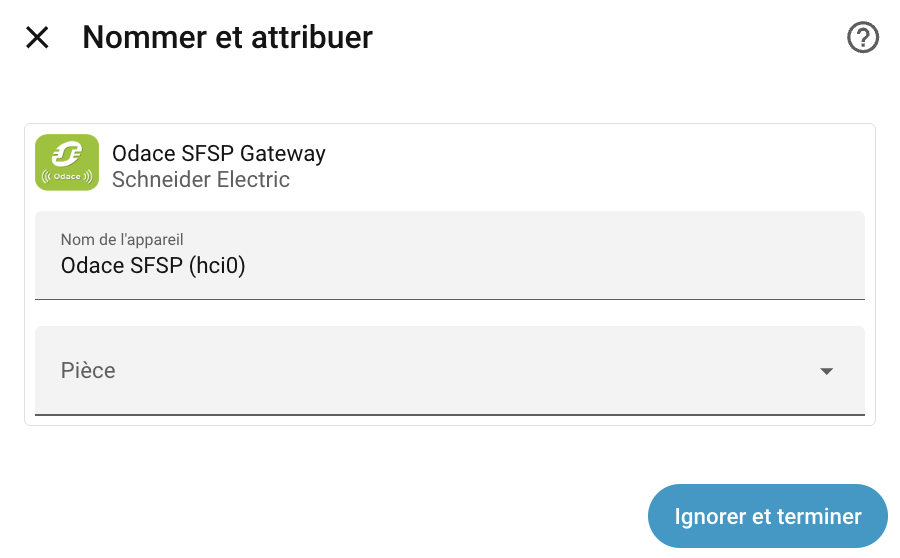

- **ESPHome** : contrôleur Bluetooth distant piloté via un ESP32 flashé avec ESPHome. Ce mode est utile pour étendre la portée en plaçant l'ESP32 près des modules Odace. Voir la section [Configuration ESPHome](#configuration-esphome) pour le script de compilation.

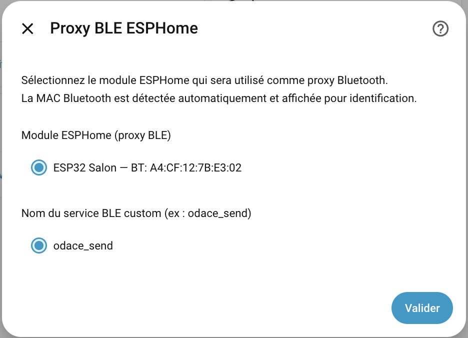

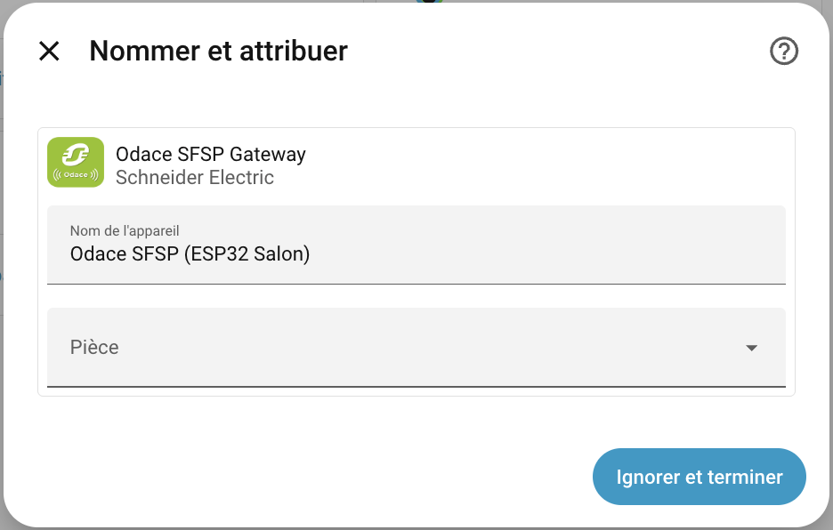

### Menu de gestion des modules

Depuis **Paramètres → Appareils et services → Schneider Odace SFSP**, cliquer sur **Configurer** pour accéder au menu principal de gestion des modules. Ce menu propose les actions suivantes : ajouter un module, modifier un module, supprimer un module, ainsi que les paramètres avancés et la modification du contrôleur Bluetooth.

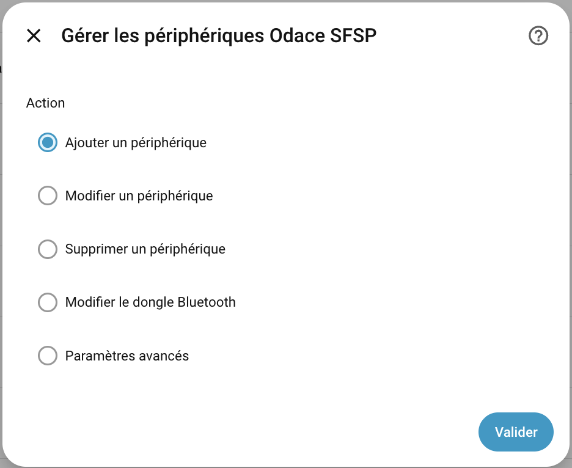

### Ajout des modules — Association

L'association d'un module Odace SFSP se fait en mode apprentissage :

1. Appuyez une fois sur le module pour le passer en mode apprentissage. Il restera dans cet état pendant 60 s (clignotant rouge et vert).
2. Depuis le menu **Configurer**, choisir **Ajouter un module**. L'intégration passe en mode apprentissage (timeout paramétrable, 60 s par défaut).
3. Le module découvert apparaît avec son UUID. Saisir un nom, vérifier le type détecté (`switch`, `dcl`, `generic`, etc.) et valider.

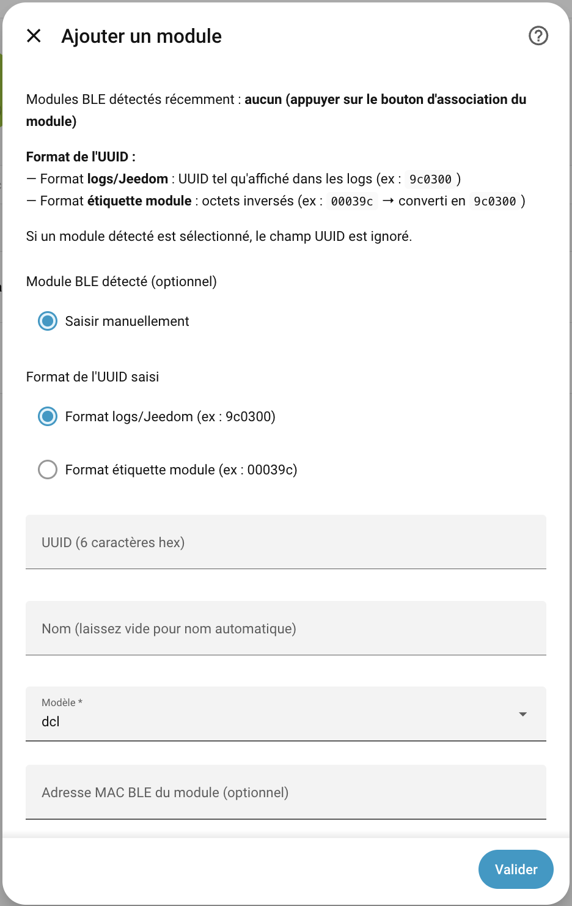

### Modification et suppression d'un module

Depuis le menu **Configurer** de l'intégration il est également possible de :

- **Modifier un module** : changer son nom ou son type. Si le type change (par exemple un DCL reclassé en `switch`), l'entité précédente est supprimée et une nouvelle entité du bon domaine est créée — aucune entité orpheline n'est laissée.

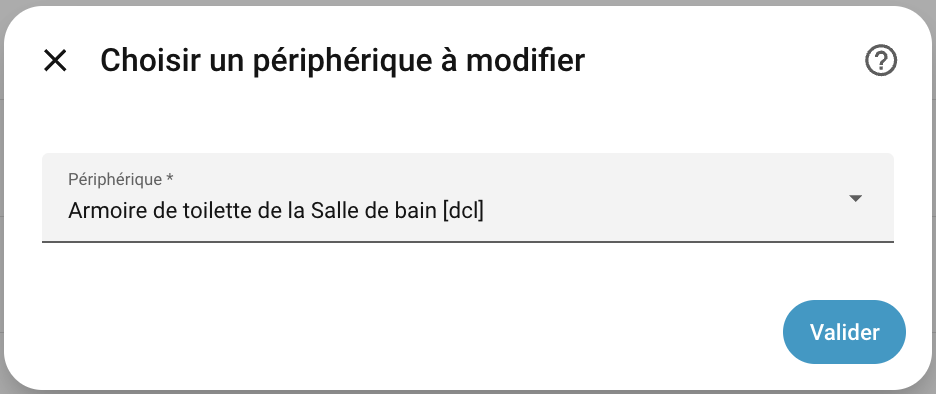

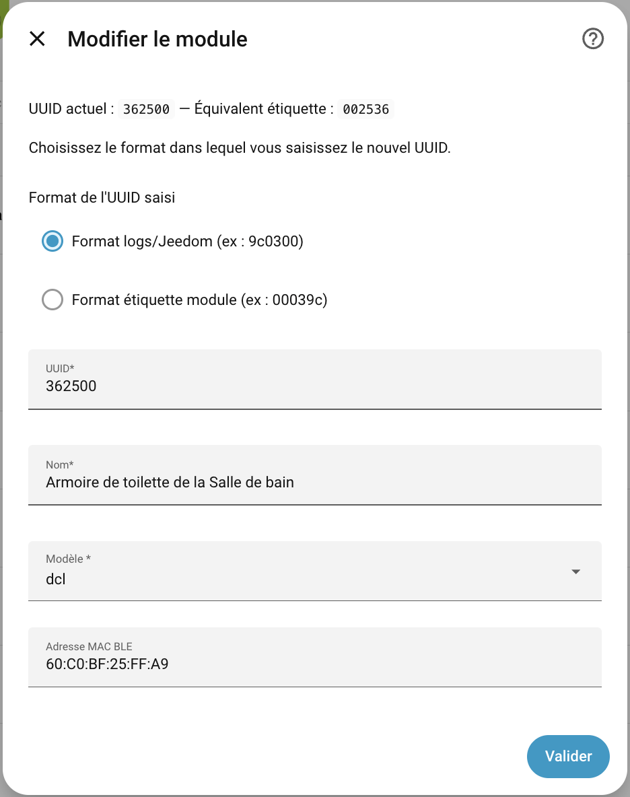

- **Supprimer un module** : retire le module de l'intégration et supprime l'entité associée.

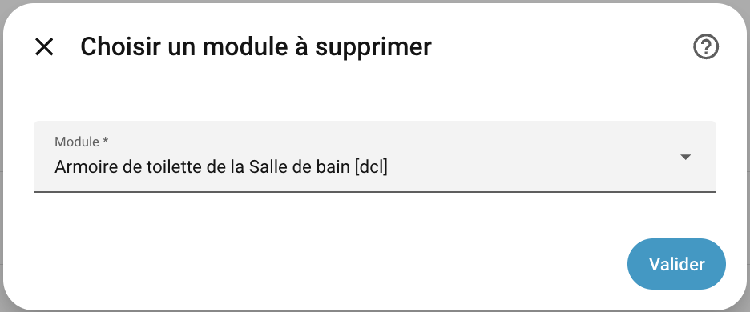

### Modification du contrôleur Bluetooth

Si le contrôleur Bluetooth est remplacé, il est possible de mettre à jour son adresse MAC dans la configuration de l'intégration sans avoir à réassocier tous les modules. L'option est disponible dans le menu **Configurer**.

### Paramètres avancés

Le menu **Paramètres avancés** propose deux options :

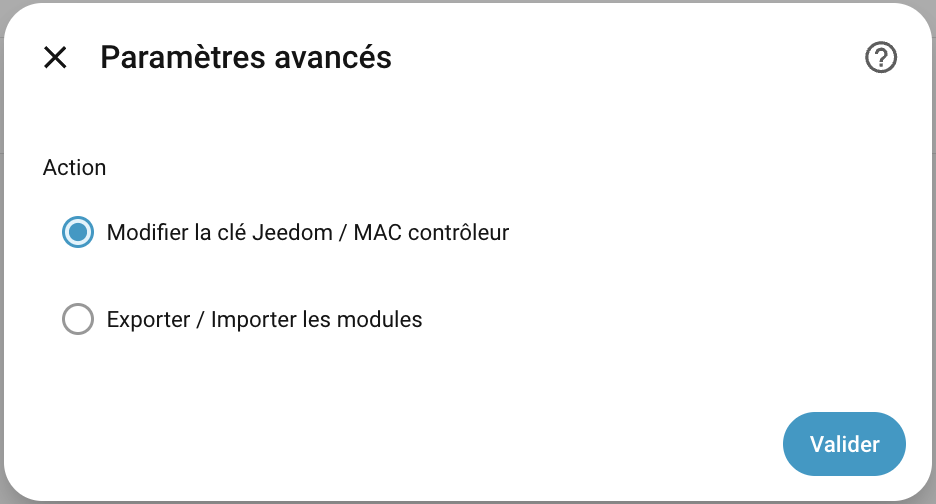

**1. Clé Jeedom et MAC du contrôleur Bluetooth**

Permet de consulter ou modifier les deux éléments clés hérités de Jeedom :

- La **JEEDOM_KEY** est la clé de chiffrement utilisée pour signer les trames BLE envoyées aux modules Odace. Elle est propre à chaque installation et peut être récupérée dans les logs de Jeedom.
- L'**adresse MAC du contrôleur Bluetooth** est l'identifiant utilisé lors de l'association des modules. Il est possible de réutiliser l'adresse MAC du contrôleur Bluetooth Jeedom d'origine avec un autre adaptateur physique — c'est ce qui permet de migrer une installation Jeedom existante vers Home Assistant sans réassocier les modules.

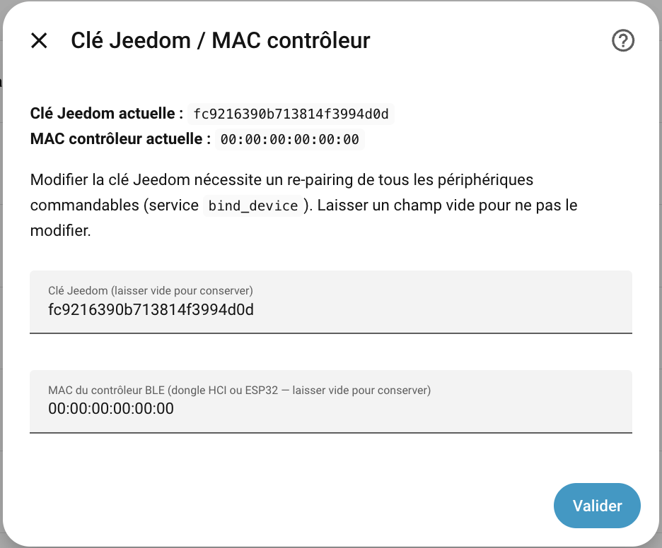

**2. Export / Import de la configuration des modules**

Permet de sauvegarder ou restaurer la liste complète des modules associés au format JSON ou YAML. Utile pour migrer l'intégration vers une nouvelle instance Home Assistant ou pour pré-renseigner les modules sans repasser par le mode apprentissage.

Exemple de format :

```yaml
"943A00": {"uuid": "943A00", "mac": "60:C0:BF:30:2B:16", "model": "switch", "name": "Interrupteur de l'Armoire de toilette de la Salle de bain"},
"123B00": {"uuid": "123B00", "mac": "60:C0:BF:30:2B:75", "model": "switch", "name": "Interrupteur du Plafonnier de la Salle de bain"},
"BF3A00": {"uuid": "BF3A00", "mac": "60:C0:BF:30:2E:39", "model": "switch", "name": "Interrupteur de l'Armoire de toilette de la Salle d'eau"},
"FF3A00": {"uuid": "FF3A00", "mac": "60:C0:BF:30:2B:60", "model": "switch", "name": "Interrupteur du Plafonnier de la Salle d'eau"}
```

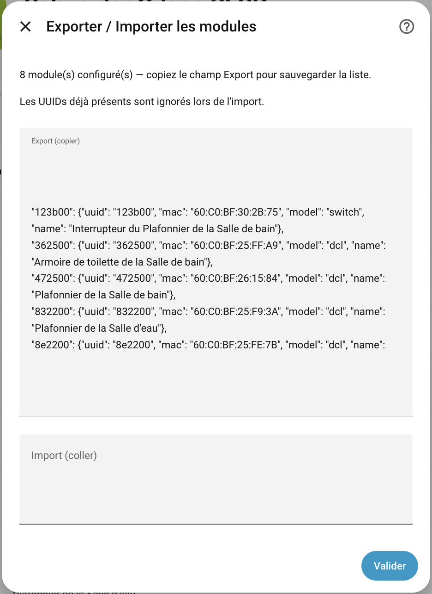

### Configuration ESPHome

Pour utiliser un ESP32 comme relais Bluetooth (mode ESPHome), le firmware doit exposer un service `odace_send` qui envoie une trame BLE brute. Voici le fragment de configuration à ajouter à votre fichier `esphome/*.yaml` :

```yaml
api:
  encryption:
    key: !secret api_doorbell
  services:
    - service: odace_send
      variables:
        payload: string
      then:
        - lambda: |-
            std::vector<uint8_t> data;
            for (size_t i = 0; i + 1 < payload.size(); i += 2)
              data.push_back((uint8_t)strtol(payload.substr(i, 2).c_str(), nullptr, 16));
            esp_ble_gap_config_adv_data_raw(data.data(), data.size());
            esp_ble_adv_params_t p{};
            p.adv_int_min = p.adv_int_max = 0x20;
            p.adv_type    = ADV_TYPE_NONCONN_IND;
            p.own_addr_type = BLE_ADDR_TYPE_PUBLIC;
            p.channel_map = ADV_CHNL_ALL;
            esp_ble_gap_start_advertising(&p);
            delay(500);
            esp_ble_gap_stop_advertising();
```

Ce service reçoit la trame hexadécimale construite par l'intégration, la décode octet par octet et l'émet en BLE non-connectable, reproduisant exactement le comportement du daemon Jeedom.

## Aide au débogage

Si l'intégration ne se comporte pas comme attendu (module non détecté, commande sans effet, erreur au démarrage), voici comment collecter les informations nécessaires pour signaler un problème.

### Activer les logs de débogage

Ajouter les lignes suivantes dans `configuration.yaml` :

```yaml
logger:
  default: warning
  logs:
    custom_components.odace_sfsp: debug
```

Redémarrer Home Assistant (**Paramètres → Système → Redémarrer**).

### Récupérer les logs

1. Aller dans **Paramètres → Système → Journaux**.
2. Filtrer sur `odace_sfsp`.
3. Copier les entrées pertinentes (trames hex reçues ou émises, messages d'erreur).

### Signaler un problème

Ouvrir une issue sur le [dépôt GitHub](https://github.com/slemeur91/odace_sfsp/issues) en incluant :

- La description du dysfonctionnement (ce qui est attendu, ce qui se passe réellement).
- Le type de module concerné (`switch`, `dcl`, `generic`, etc.) et son UUID si connu.
- Les logs de débogage collectés ci-dessus.
- La version de l'intégration et de Home Assistant.

---

[releases-shield]: https://img.shields.io/github/release/slemeur91/odace_sfsp.svg?style=flat-square
[releases]: https://github.com/slemeur91/odace_sfsp/releases
